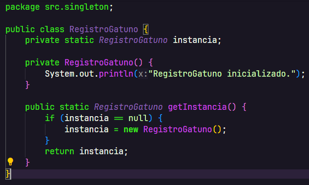
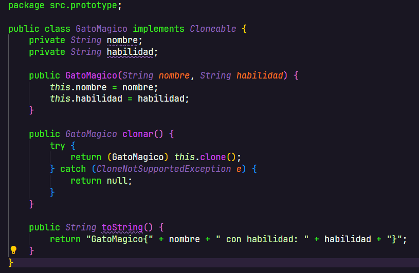
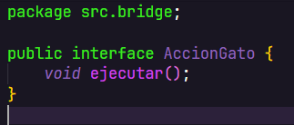
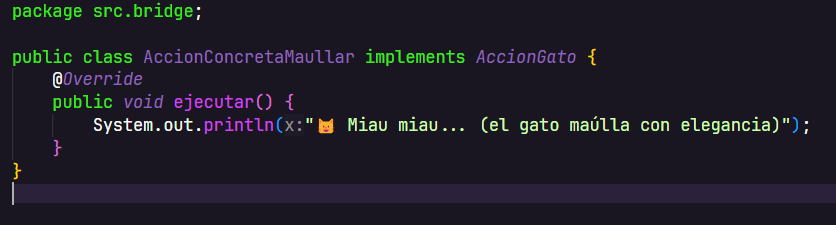
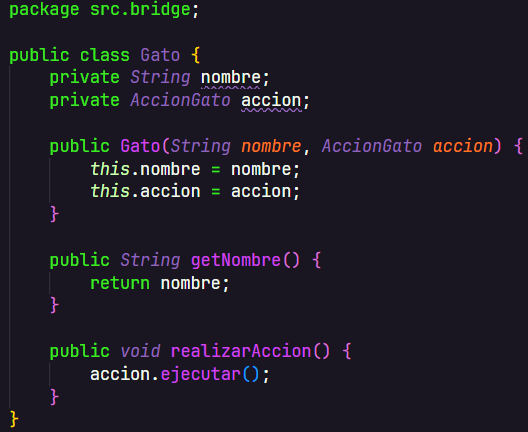
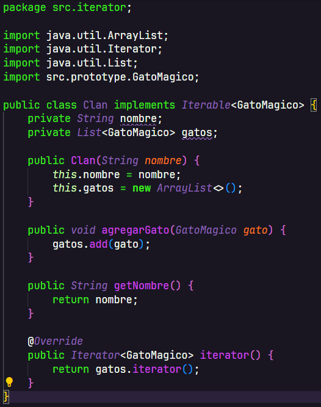
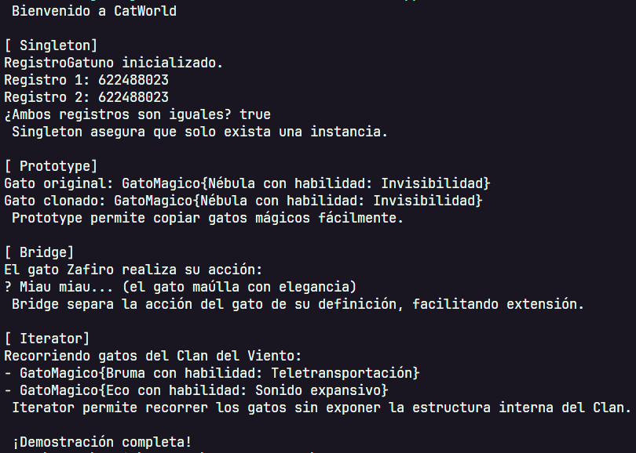

# 🐾 CatWord — Patrones de Diseño en Java

## 📘 Descripción del sistema

**CatWord** es una aplicación en Java estándar que ejemplifica el uso de cuatro patrones de diseño clásicos (Singleton, Prototype, Bridge, Iterator) mediante un sistema de gatos mágicos y clanes. El objetivo es demostrar cómo estos patrones ayudan a construir software más mantenible, flexible y extensible.

nota: La idea salio de un examen llamado Nullcatia

### 🎯 Problema a resolver

En un mundo de gatos mágicos, se necesita:
- Un registro global de gatos (único y centralizado).
- La capacidad de clonar gatos con habilidades únicas.
- Flexibilidad para agregar nuevas acciones sin modificar las clases de gatos.
- Un sistema para recorrer clanes de gatos sin exponer su estructura interna.

---

## 🧠 Patrones aplicados

### 🟦 Singleton — `RegistroGatuno.java`

- **Propósito:** Garantizar que el registro de gatos mágicos sea único y compartido en toda la aplicación.
- **Implementación:** `RegistroGatuno` asegura una única instancia accesible mediante `getInstance()`.
- **Justificación:** Evita inconsistencias en el almacenamiento de datos mágicos.

 

### 🟩 Prototype — `GatoMagico.java`

- **Propósito:** Clonar gatos mágicos con sus habilidades.
- **Implementación:** Implementa `Cloneable` y sobreescribe `clone()`.
- **Justificación:** Permite generar copias rápidas de gatos sin crear instancias nuevas manualmente.

### 🟨 Bridge — `AccionGato.java`, `AccionConcretaMaullar.java`, `Gato.java`

- **Propósito:** Separar la lógica de acción de la clase del gato.
- **Implementación:** `Gato` tiene una referencia a `AccionGato`, permitiendo cambiar acciones dinámicamente.
- **Justificación:** Facilita agregar nuevas acciones sin modificar las clases de gatos.

### 🟥 Iterator — `Clan.java`

- **Propósito:** Recorrer los gatos del clan de forma uniforme.
- **Implementación:** `Clan` implementa un iterable interno que permite recorrer gatos mágicos.
- **Justificación:** Se oculta la estructura interna del clan, facilitando su uso externo.

---

## 🚀 Instrucciones de compilación 

### 🛠 Requisitos

- Java JDK 8 o superior
- IDE como IntelliJ, VS Code 
- Consola o terminal

## 🚀 Instrucciones de compilación 

- Run project (el boton correstpondiente desde el ide)

